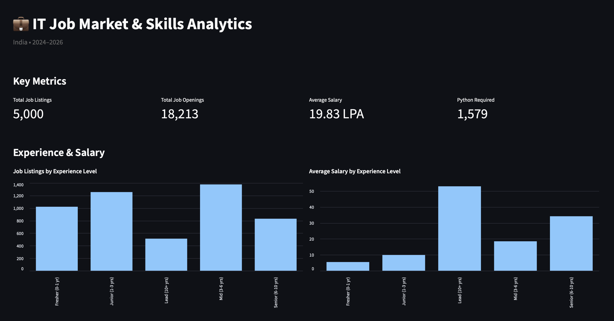
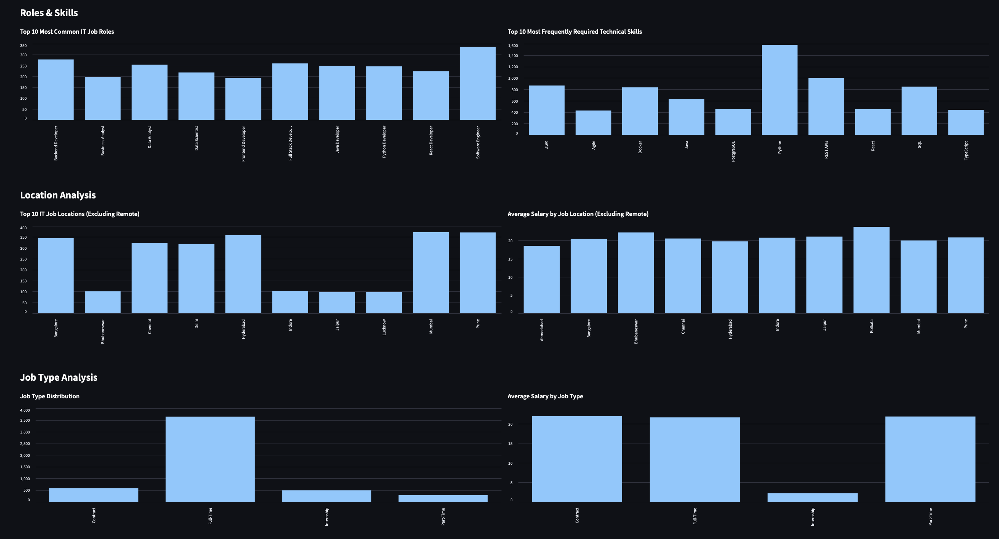
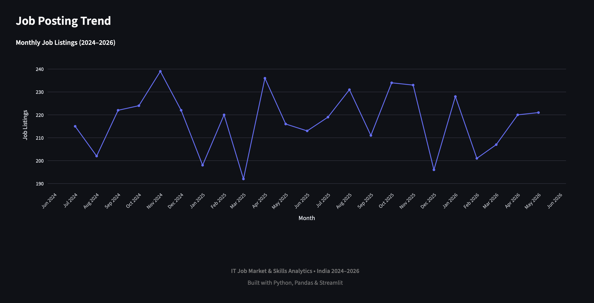

# 💼 IT Job Market & Skills Analytics

An interactive data analytics project that explores the Indian IT job market using job listings from **2024–2026**.

The project analyzes job roles, salaries, experience levels, technical skills, locations, education requirements, job types, work modes, and job posting trends using Python-based data analysis and an interactive Streamlit dashboard.

---

## 📊 Dashboard Preview

### Main Dashboard



### Location & Job Type Analysis



### Job Posting Trend



---

## 🎯 Project Objectives

The main objectives of this project are to:

* Explore patterns in the Indian IT job market
* Analyze salary differences across experience levels and job roles
* Identify frequently required technical skills
* Analyze job opportunities across different locations
* Understand education requirements in job listings
* Compare different job types and work modes
* Analyze monthly job posting trends
* Build an interactive dashboard for exploring the dataset

---

## 🛠️ Technologies Used

* **Python**
* **Pandas**
* **NumPy**
* **Matplotlib**
* **Plotly**
* **Jupyter Notebook**
* **Streamlit**
* **Git & GitHub**

---

## 📁 Project Structure

```text
IT-Job-Market-Skills-Analytics/
│
├── app.py
├── requirements.txt
├── README.md
│
├── data/
│   ├── india_job_market_2024_2026.csv
│   └── job_skills.csv
│
├── notebooks/
│   └── 01_job_market_analysis.ipynb
│
├── screenshots/
│   ├── dashboard.png
│   ├── dashboard_analysis.png
│   └── job_posting_trend.png
│
└── visualizations/
    ├── top_10_job_roles.png
    ├── average_salary_by_experience.png
    ├── top_10_technical_skills.png
    ├── top_10_highest_paying_roles.png
    ├── top_10_it_job_locations.png
    └── monthly_job_posting_trend.png
```

---

## 📂 Dataset

The project uses the **India Tech Jobs 2024–2026 | Salary & Skills** dataset.

The dataset contains **5,000 job listings** and includes information such as:

* Job Title
* Company
* Company Type
* Industry
* City
* Location Tier
* Experience Level
* Job Type
* Work Mode
* Salary (LPA)
* Required Skills
* Education Required
* Openings
* Applicants
* Company Rating
* Date Posted

The dataset was explored and cleaned using Pandas before performing the analysis.

---

## 🔎 Analysis Performed

### Experience & Salary

* Job listings by experience level
* Average salary by experience level
* Total job openings by experience level

### Roles & Skills

* Most common IT job roles
* Most frequently required technical skills
* Highest-paying job roles based on average salary in the dataset

### Location

* Job listings by city
* Average salary by city
* Remote listings excluded from physical city comparisons

### Education

* Education requirements across job listings
* Average salary by education qualification

### Job Type & Work Mode

* Full-time, contract, internship, and part-time distributions
* Average salary by job type
* Job listings by work mode
* Average salary by work mode

### Companies

* Companies with the highest number of listings within the dataset

### Job Posting Trend

* Monthly job listing trend from 2024 to 2026
* Interactive Plotly visualization with month and year labels

---

## 📌 Key Insights

Some notable observations from the analysis include:

* **Software Engineer** was the most frequently listed job role in the dataset.
* **Python** was the most frequently required technical skill.
* Average salary varied substantially across experience levels.
* Lead and Senior positions had higher average salaries than Junior and Fresher positions in the dataset.
* Mumbai, Pune, Hyderabad, Bangalore, Chennai, and Delhi were among the most frequently represented physical job locations.
* B.Tech/B.E. was the most common education requirement.
* Full-time positions represented the largest job-type category.
* The monthly job posting analysis showed how listing volume changed over the available period.

> These observations describe patterns within this dataset and should not be interpreted as a complete representation of the entire Indian IT job market.

---

## 🎛️ Interactive Dashboard

The Streamlit dashboard provides interactive filters for:

* Experience Level
* Work Mode
* Job Type
* Location
* Education Required

Changing the filters dynamically updates the dashboard's KPIs and visualizations.

### Key Metrics

The dashboard displays:

* Total Job Listings
* Total Job Openings
* Average Salary
* Python Required

---

## 🚀 How to Run the Project

### 1. Clone the repository

```bash
git clone https://github.com/Taranbeer-singh/IT-Job-Market-Skills-Analytics.git
```

### 2. Navigate to the project directory

```bash
cd IT-Job-Market-Skills-Analytics
```

### 3. Create a virtual environment

```bash
python -m venv .venv
```

### 4. Activate the virtual environment

#### macOS / Linux

```bash
source .venv/bin/activate
```

#### Windows

```bash
.venv\Scripts\activate
```

### 5. Install dependencies

```bash
pip install -r requirements.txt
```

### 6. Run the Streamlit dashboard

```bash
streamlit run app.py
```

The dashboard will open in your browser.

---

## 📓 Jupyter Notebook

The complete exploratory data analysis is available in:

```text
notebooks/01_job_market_analysis.ipynb
```

The notebook contains data exploration, cleaning, statistical analysis, visualizations, and conclusions from the dataset.

---

## 📈 Dashboard Features

* Interactive sidebar filters
* Dynamic KPI calculations
* Experience-level analysis
* Salary analysis
* Job role analysis
* Technical skills analysis
* Location analysis
* Job type analysis
* Monthly job posting trend
* Interactive Plotly visualization

---

## 💡 Skills Demonstrated

This project demonstrates practical experience with:

* Data cleaning
* Exploratory Data Analysis (EDA)
* Data transformation
* Pandas DataFrames
* NumPy
* Data aggregation and grouping
* Statistical summaries
* Data visualization
* Interactive dashboards
* Streamlit
* Plotly
* Jupyter Notebook
* Git and GitHub

---

## 👨‍💻 Author

**Taranbeer Singh**

BCA Graduate | Data Science & AI | Web Development

GitHub:
https://github.com/Taranbeer-singh

---

## 📄 License

This project is intended for educational, portfolio, and learning purposes.
